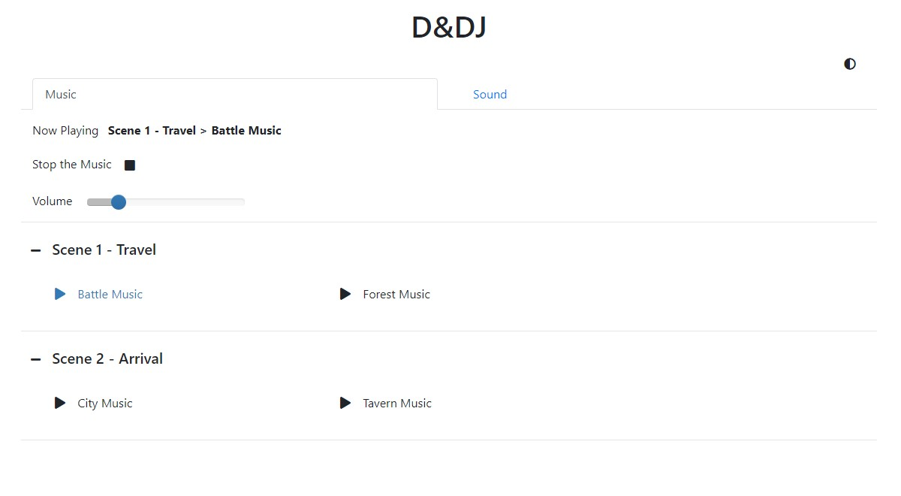
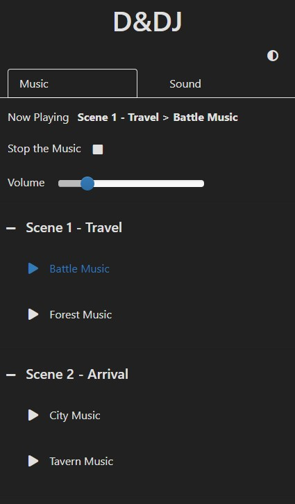

[](https://travis-ci.com/janbrrr/dndj)

# D&DJ

*D&DJ* was created to help dungeon masters incorporate music and sounds into their storytelling. The idea is to prepare the music and sounds you want to use for specific scenes in advance and then being
able to play them without much hassle.

### Overview

- Prepare a configuration file defining the music and sounds you want to use
  - Supports links to YouTube videos (music)
  - Supports start_at and end_at parameters
- Start the server with the config (and connect the server to the speakers)
  - The server acts as the media player
- Visit the hosted web page from a device in the same network (e.g., phone)
  - The web page displays the available music and sounds (as specified in the config)
  - Play music, stop the music, change the volume or play sounds

Desktop View (Light Mode)            |  Mobile (Dark Mode)
:-------------------------:|:-------------------------:
  |  


### How does it work under the hood?

The server is an asynchronous server that uses [aiohttp](https://github.com/aio-libs/aiohttp/). 
Clients can connect to the server via the hosted web page and they then connect via websockets. 
Every connected client will always know what music is currently being played, what the volume is and 
will be notified when a change occurs.

The web page shows the clients the preconfigured music and sounds that are available and allows them to request to
play a music track, stop the music, change the volume or play sounds. The server will receive these requests
and fulfill them using [python-vlc](https://github.com/oaubert/python-vlc) (VLC media player bindings) for the music and 
[pygame](https://github.com/pygame/pygame) for the sounds.

If the music is a link to a YouTube video, [pafy](https://github.com/mps-youtube/pafy) will get the link to
the audio stream and pass it to the VLC media player.

# Table Of Contents
- [Getting Started](#getting-started)
  - [Requirements & Installation](#requirements-and-installation)
  - [Running the Example](#example)
- [User Guide](#guide)
  - [Configuring the Music and Sounds](#guide-config)
  - [Setting up the Server and the Web Page](#guide-setup)
  - [Words of Advice](#guide-advice)
- [Additional Scripts](#scripts)
  - [Audio Format Converter](#scripts-format)
- [Resource Recommendations](#resources)
  - [Music & Ambience](#resources-music)
  - [Sounds](#resources-sound)
- [Tests](#tests)

# <a name="getting-started"/>Getting Started

## <a name="requirements-and-installation"/>Requirements & Installation

First, you need to have [Python](https://www.python.org/) installed, version 3.6 or higher.

Next, set up a virtual environment.
1. Make sure `virtualenv` is installed by typing `pip install virtualenv` in the terminal
2. Change the directory to this project's root and type `virtualenv venv` to create the virtual environment
3. Activate the virtual environment (`(venv)` should appear before the directory)
    1. On Windows: `venv\Scripts\activate`
    2. On Linux: `source venv/bin/activate`
4. Install the requirements with `pip install -r requirements.txt`
    1. Use the `requirements-dev.txt` if you are a developer

Whenever you want to execute the program from the terminal, make sure the virtual environment is active.

This project uses the [VLC media player](https://www.videolan.org/vlc/) to play the music, so make sure to have it installed as well.

## <a name="example"/>Running the Example

Run the example by typing `python start_server.py example/config.yaml`.

Now you can visit `127.0.0.1:8080` in your browser and start playing around with it.

Credits to [Tabletop Audio](https://tabletopaudio.com/) for some of the music/ambience in the example.
The audio is licensed under
[CC BY-NC-ND 4.0](https://creativecommons.org/licenses/by-nc-nd/4.0/).

Sound Credits (licensed under [CC BY 3.0](https://creativecommons.org/licenses/by/3.0/))
- "Footsteps, Dry Leaves, G.wav" by [InspectorJ](www.jshaw.co.uk) of [Freesound.org](https://freesound.org)
- "steps on a wood branch - actions" by [julius_galla](https://freesound.org/people/julius_galla/) of [Freesound.org](https://freesound.org)

# <a name="guide"/>User Guide

## <a name="guide-config"/>Configuring the Music and Sounds

The configuration file is a `YAML` file. It contains two sets of configurations, one for the music
and one for the sound.

```yaml
music:
  # content ...
sound:
  # content ...
```

### Music

The music configuration is divided into a hierarchical structure.

At the root is the `music` element that defines at least the `volume`
and a list of `groups` that will be used.

```yaml
music:
  volume: 20  # value from 0 (mute) to 100 (max)
  directory: path/to/dir  # (Optional) used if all files are in the same dir
  sort: true  # (Optional, default=true) whether to sort the groups alphabetically
  groups: []  # a list of groups
```

A `group` can for example be a scene in the story. It has a `name` and defines a collection
of `track_lists` (i.e., playlists).

```yaml
music:
  # ...
  groups:
  - name: Scene 1 - Travel
    directory: path/to/dir  # (Optional) used if all files of a group are in the same dir
    sort: true  # (Optional, default=true) whether to sort the tracklists alphabetically
    track_lists: []  # a list of tracklists
  - name: Scene 2 - Arrival
    # ...
```

A `track_list` also has at least a `name` and defines a collection of `tracks` that
it will play.

```yaml
music:
  # ...
  groups:
  - name: Scene 1 - Travel
    # ...
    track_lists:
    - name: Forest Ambience
      directory: path/to/dir  # (Optional) used if all files of a tracklist are in the same dir
      loop: true  # (Optional, default=true) whether to loop if all tracks have been played
      shuffle: true  # (Optional, default=true) whether to shuffle the tracks before playing them all
      tracks: []  # a list of tracks
```

Finally, a `track` refers to a music file or YouTube link. In the simplest case it is only a filename (link),
but you can further configure it. Every file type that the VLC media player supports should work.

Keep in mind that streaming the audio from YouTube will introduce a delay of a second or two to build up the
connection etc.
```yaml
music:
  # ...
  groups:
  - name: Scene 1 - Travel
    # ...
    track_lists:
    - name: Forest Ambience
      # ...
      tracks:
      - forest_ambience_1.mp3                          # can either be a filename
      - https://www.youtube.com/watch?v=HAw37tUHcOo    # or a YouTube video
      - file: forest_ambience_2.mp3                    # or more specific (`file` can be a filename or link)
        start_at: 0:0:10  # (Optional) the format is %H:%M:%S
        end_at: 0:0:20    # (Optional) the format is %H:%M:%S
```

### Sound

The `sound` configuration is very similar to the `music` configuration.

At the root is the `sound` element that defines at least the `volume`
and a list of `groups` that will be used.

```yaml
sound:
  volume: 1  # value from 0 (mute) to 1 (max)
  directory: path/to/dir  # (Optional) used if all files are in the same dir
  sort: true  # (Optional, default=true) whether to sort the groups alphabetically
  groups: []  # a list of groups
```

A `group` has at minimum a `name` and defines a collection
of `sounds` (e.g., footstep sounds).

```yaml
sound:
  # ...
  groups:
  - name: Meele Attacks
    directory: path/to/dir  # (Optional) used if all files of a group are in the same dir
    sort: true  # (Optional, default=true) whether to sort the sounds alphabetically
    sounds: []  # a list of sounds
  - name: Footsteps
    # ...
```

A `sound` is not a single sound file, but a collection of sound files. If the `sound` is being played, one of its
associated files will be played at random. 

For example, a sound named *Sword Hit* may list several different
sound files, each being a variant of a sword hit. When *Sword Hit* is being played, one of the files
will be played at random to introduce a bit of variety.

```yaml
sound:
  # ...
  groups:
  - name: Meele Attacks
    # ...
    sounds:
    - name: Sword Hit
      directory: path/to/dir  # (Optional) used if all files of a sound are in the same dir
      files: []  # a list of sound files
```

Finally, a sound `file` is in the simplest case just a filename, but it also can be a more
specific configuration. Note that only `.ogg` and `.wav` files are supported.

```yaml
sound:
  # ...
  groups:
  - name: Meele Attacks
    # ...
    sounds:
    - name: Sword Hit
      # ...
      files:
      - sword_hit_1.ogg         # can either be a filename
      - file: sword_hit_2.wav   # or a more specific config
        end_at: 0:0:2  # (Optional) the format is %H:%M:%S
```

### Splitting the config into multiple files

If you want to, you can always include other `YAML` files in your main config file.

```yaml
### main_config.yaml ###

# ...
sound:
  # ...
  groups:
  - !include path/to/footsteps_config.yaml
  - !include path/to/spells_config.yaml
```

```yaml
### footsteps_config.yaml ###

name: Footsteps
directory: path/to/footsteps/dir
sounds:
- name: Dry Leaves
  files:
  - footsteps_dry_leaves.wav
- name: Monster
  files:
  - footsteps_monster.wav
```

## <a name="guide-setup"/>Setting up the Server and the Web Page

If you want to access the web page from a different device, e.g., your phone, you have to look up the IP address of
the host computer and host the server on this IP address.

On Windows you can open the command line and enter `ipconfig` as command to view your IPv4 address.
On Linux you can use `ifconfig`. For simplicity, assume your IP address is 192.168.1.1 in the following.

Run the `start_server.py` script as follows: `python start_server.py --host "192.168.1.1" "path/to/config.yaml"`

Now you can visit the url `192.168.1.1:8080` from any device that is in the same network as the host computer.

## <a name="guide-advice"/>Words of Advice

Here is a bit of advice I would give. You may agree or disagree with it, see what works for you.

### Use Music to Emphasize

The first point is to not overuse music. Use music to emphasize special situations and changes in the atmosphere.
By that I mean to play a *single* track that fits, not a whole playlist. By doing so the music feels much more impactful
when it plays.

For example, when the party meets the villain for the first time, you can play some dark super villain music 
(maybe even give the villain his own soundtrack). Or when something sad happens or a sad story is being told, 
emphasize the sadness by underlying it with sad music.

Think you of the situations you expect to arise in your story and how you can use music to emphasize some of them.

### Use Ambience as Background Music

Second, I recommend to use *ambience* as default background "music" instead of using music. 

For example, when the party is in a forest, play some forest ambience to set the scene
and make the journey more immersive.
When the party enters a tavern, switch to tavern ambience.

As the DM you will know the locations that will appear in your story, so you can prepare appropiate ambience
for them.

### Use Sounds along with Descriptions

This aspect is more difficult, because it can be very challenging to find the sound effects you want and 
that fit your situation. Anyway, I like to incorporate sound effects into my descriptions of what is happening.

If there is an explosion, play the sound of the explosion. If the party is in the forest and hears footsteps,
play the sound of footsteps on leaves.

# <a name="scripts"/>Additional Scripts

## <a name="scripts-format"/>Audio Format Converter

For sound files the only supported formats are `.wav` and `.ogg`.

If you happen to have a different format or simply want to convert your audio files into a different format,
you can use the `scripts/convert_file.py` script. This script uses [pydub](https://pydub.com/) to perform the conversion.
Refer to the official pydub homepage for more information regarding the installation.

`python convert_file.py path/to/file-or-dir format`

- The first argument is the file to convert or a directory (will convert every file in the directory)
- The second argument is the output format (e.g., `ogg` or `wav`)
- The following arguments are *optional* and only work for files and not directories
  - use `--start X` to have the audio start at `X` milliseconds
  - use `--end X` to have the audio end at `X` milliseconds
  - use `--out X` to change the output name to `X` (name excludes extension)

The converted file(s) will be in the same directory as the source file(s) and have the same name (except the extension).

*Example:* 

`python convert_file.py --start 5000 --end 8000 --out new_sound path/to/sound.wav ogg` 

This converts `sound.wav` located at `path/to/` to `new_sound.ogg` located at `path/to/`
and `new_sound.ogg` consists of the part starting at 5000 ms and ending at 8000 ms.

# <a name="resources"/>Resource Recommendations

## <a name="resources-music"/>Music & Ambience

Here is small collection of sources where you can discover great music.

- [Adrian von Ziegler](https://www.youtube.com/channel/UCSeJA6az0GrNM4_-pl3HQSQ) (Fantasy Music)

- [BrunuhVille](https://www.youtube.com/user/BrunuhVille/) (Fantasy Music)

- [Derek & Brandon Fiechter](https://www.youtube.com/channel/UCjMZjGhrFq_4llVS_x2XJ_w/) (Fantasy Music)

- [Michael Ghelfi](https://www.youtube.com/user/MichaelGhelfi) (Fantasy Music and Ambience)

- [Peter Crowley's Fantasy Dream](https://www.youtube.com/user/PeterCrowley83/) (Fantasy Music)

- [Secession Studios](https://www.youtube.com/user/thesecession/) (Cinematic Music)

- [Tabletop Audio](https://tabletopaudio.com/) (Music and Ambience)

- [Vindsvept](https://www.youtube.com/channel/UCfSUheoljDlGDjerRylO4Nw) (Fantasy Music)

## <a name="resources-sound"/>Sounds

Finding sounds is quite challenging. So far I make use of the following free websites and hope they have what I need.
- [Freesound](https://freesound.org/)
- [Zapsplat](https://www.zapsplat.com/)

If you can spend some coin, there is also the option to buy professional sound packs that fulfill your needs.

If you are a mad scientist, you can also try to extract the sound files from your favorite RPG video game.

# <a name="tests"/>Tests

In order to run the tests simply type the command `pytest`.

### Coverage

In order to generate a coverage report type the following:
- `coverage run -m pytest`
- `coverage html`

The coverage report will be available in `coverage_html/index.html`.

### Code Style

In order to check the code against style conventions type the command `flake8`.